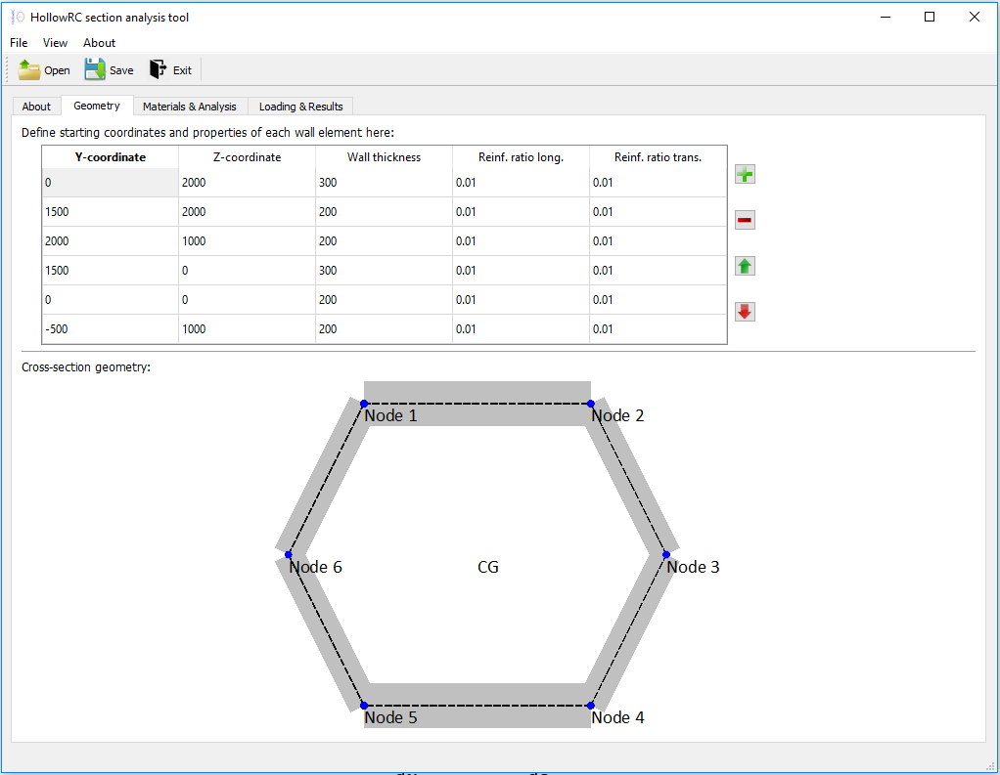
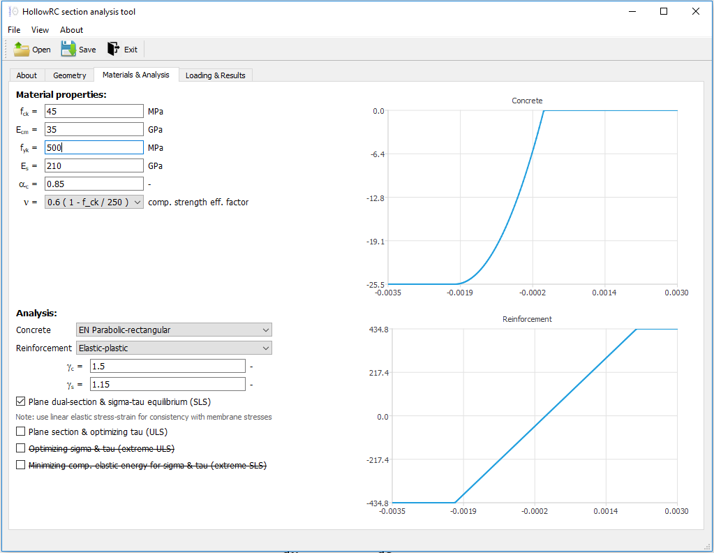
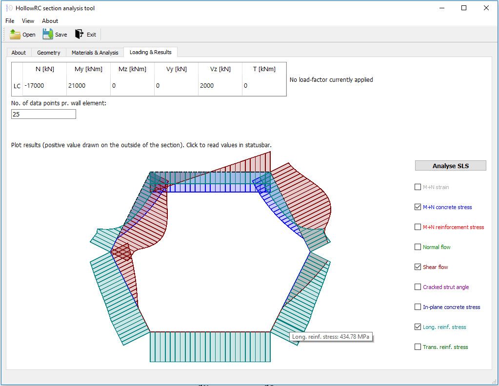
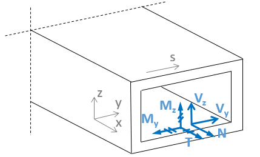

# HollowRC

A Python library for general design of hollow reinforced concrete sections under combined actions packed into an easy to use executable.

## Getting Started - Installation

The easy way:

1. Download the [latest release](https://github.com/Kleissl/HollowRC/releases/latest/download/HollowRC.zip)
2. Unzip the distribution package
3. Execute HollowRC.exe

If you're familiar with Python and prefer to run the code directly:

1. Fork/clone the repository or download the [zipped master-branch source code](https://github.com/Kleissl/HollowRC/archive/master.zip)
2. Pip install requirements.txt
3. Run python main.py

## About

This is an easy to use design tool for analysis of hollow reinforced concrete sections under combined loading, fully embracing the interactions between bending and shear behaviour.
To propor describe the interaction between the flow of normal stesses and shear stress and to fully utilize the capacity of the cross-section one must leave the simplfied approach of the diagonal truss model.
For a linear-elastic material one could apply the Grashof's formula, similar to analysis of thin-walled steel-sections, to determining shear flow etc.
However, with the basic assumption of linear-elastic material behaviour being unsuitable for reinforced concrete, a more numerical extensive approach involving a series of optimization routines needs to be adopted.
To make this analysis method more approachable, this easy to use application has been developed.

### Service Limit State

This design tool provides designers with a superior insight into the actual stress state during Service Limit State (SLS), including the shear or torsion induced stresses in the transverse reinforcement (in the circumferential direction), and will completely avoid any superposition of plastic lower bound methods from the diagonal truss model, additional shear-induced demand for longitudinal reinforcement and the corresponding strain incompatibilities introduced by separating shear and bending analysis.
For SLS the actual shear flow is determined based on a plane dual-section analysis, which just means that two nabouring plane-sections are analysed and from their differences in normal flow, simple equilibrium yields the corresponding shear flow distribution.
So only by applying the fundamental flexural member assumption of plane sections must remain plane combined with basic equilibrium equations can the actual normal and shear flow distributions be determined.
From this an in-plane membrane analysis is used to determined the reinforcement stresses etc. by choosing the resulting compressive stress direction / strut angle such that it minimizes the complementary strain energy (similar to fulfilling compatibility).

### Ultimate Limit State

For Ultimate Limit State (ULS) this design tool allow designers to push the capacity of the cross-section even further, as it by use of mathematical optimization algorithms are able to identify the true optimal plastic lower-bound solution that fully utilize the strength of the materials.
For ULS a classic plane section analysis is performed and from its normal flow distribution, an in-plane membrane analysis considering the yield conditions determines the leftover shear flow capacity at any given point along the cross-section, which then is integrated into a shear force capacity for each of the cross-sectional wall elements. Finally this is followed up by solving the optimization problem of maximizing the load-factor while maintaining equalibrium between the wall shear forces and the user specified global sectional forces.

### Assumptions and limitations

The implementation is based on the following assumptions:

* The span to depth ratio of the section is sufficient for beam theory to be applicable where plane section analysis approach is considered.
* The walls are sufficient thin, compared to the cross-section dimensions, for a thin-walled approach to be applicable.
* Normal stresses in the circumferential direction are neglected even though equilibrium in principle requires the presence of these (this is a very common approach when analysing thin-walled sections).
* Sufficient minimum reinforcement to provide the nesessary ductility capacity for plastic redistribution.
* Does not cover instabilities or shear lag effects (yet).
* For now it's limited closed single-cell hollow cross-sections

## Documentation

The complete verification methodology is described in [this paper](docs/Paper_Kleissl_Costa.pdf).

### Illustration of Graphical User Interface (GUI)

This sections shows a few screen-dumps of the GUI.
The image below shows the "Geometry"-tab, where the cross-sectional geometry is defined. Features like specifying coordinates for new nodes via mouse click and movement of existing nodes via mouse drag-drop have been implemented to ease the input process.

The image below shows the "Material and Analysis"-tab, where the material properties and the analysis properties is provided. Graphical illustration of the specified constitutive relations (stress-strain curves) are shown on the right for both concrete and reinforcement.

Lastly the image below shows the "Loading and Results"-tab, where the combination of sectional forces is provided and the resulting force flows and stresses illustrated.
An interactive shaded visualisation with overlaying of user-specified results allows for quick exploration of the results, while specific values can be read by hoovering or clicking on points of interest.

### Sign convention

The sign convention generally follows a right hand system (RHS). See illustration in figure below.

Geometry:

* All dimensions are in millimeters
* The section walls must be defined in the clock-wise direction
* Angles are taken positive in the counter-clockwise direction starting from the y-axis
* Reinforcement ratios are defined as the steel-to-concrete ratio (e.g. 0.01 = 1%)

Flows & Stresses:

* Normal flow and normal stress are positive for tension
* Shear flow is positive in the counter-clockwise direction

Section forces:

* Positive My moment yields compression in the top
* Positive Mz moment yields compression on the right side
* Negative N (normal force) yields compression
* Positive Vy yields shear in the y-direction (right)
* Positive Vz yields shear in the z-direction (upward)
* Positive T (torsion) yields counter-clockwise shear flow

## Issues

If you experience a problem with the application please provide the feedback by raising an issue on this GitHub repository ([New issue](https://github.com/Kleissl/HollowRC/issues/new)).

## Versioning

For the versions available, see the [tags on this repository](https://github.com/Kleissl/HollowRC/tags).

## Author

**Kenneth C. Kleissl** - [Kleissl](https://github.com/Kleissl)

## License

The HollowRC project is licensed under the GNU GPL license, so any code using it must also be under the same license - see the [LICENSE](LICENSE) file for details.

## Acknowledgments

* Thanks to the COWI Foundation for funding the development of the concept and drafting of the first working version.
* Thanks to João Luís Domingues Costa for valuable discussions and feedback to the project
